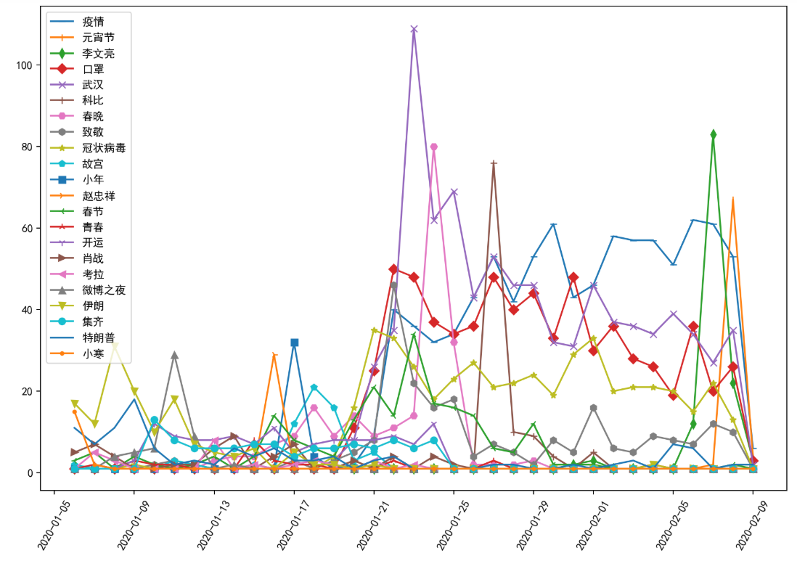

# weiboWordCount

#### 介绍
案例名：基于nltk的微博热点趋势大数据分析

 在本次案例中，我们首先需要通过爬虫程序抓取微博的文本内容，然后使用结巴分词对每个博主的微博进行分词处理，然后汇总每个博主的分词获得总词袋，再计算总词袋中词汇的每日文档频率（视每个博主每天所有微博为一个文档）。这样我们可以获得每一天微博热点词汇的排行。

 数据分析的展开，我们又分成三个步骤：
 
 第一步，我们需要累加30日内所有热点词的每日文档频率，获得热点词的30日总文档频率。
 
 第二步，我们需要选取出top20的热点词，然后把这些top20热点词的每天的文档频率做为一行，添加日期属性后，合并成一个DataFrame。
 
 第三步，我们需要利用matplotlib画出这个Dataframe中top20热点词的文档频率的变化趋势曲线图。
 
 通过这个曲线图，我们可以清晰地看到，近30日内公众在的微博中关注的热点从出现，到发酵，到热议，到降温，到遗忘的整个过程。

### 项目背景
这个是为带学生进行9周实训自己编写的一个演示程序，主要为了展示如何在Vue前端和Flask后端之间建立数据访问机制。
1、Vue前端开发时可以用nodejs进行管理，发布时需要build，然后把静态页面部署到nginx或者其他www服务器中。
2、Flask后端则直接用run-back.py启动

#### 软件架构
前端用Vue构建界面，后端用Flask微服务结构，数据存储不限制，可以是mongoDB或者mysql或者Redis

#### 使用说明

1.  前端启动: 可以用run-front.py脚本启动，也可以用npm run dev启动
2.  后端启动：可以用run-back.py脚本启动
